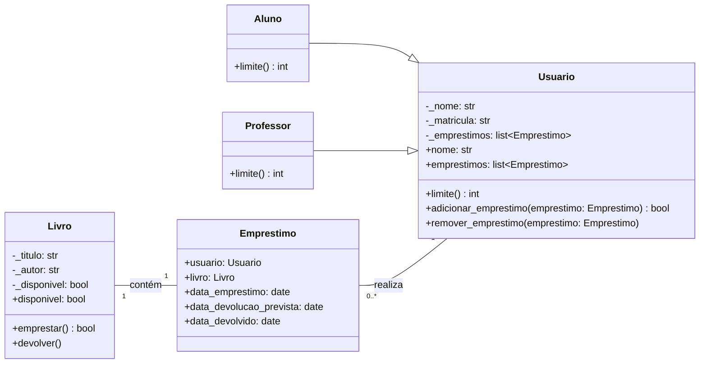

```mermaid
classDiagram
  direction RL
  class Usuario {
    -_nome: str
    -_matricula: str
    -_emprestimos: list~Emprestimo~
    +limite() int
    +adicionar_emprestimo(emprestimo: Emprestimo) bool
    +remover_emprestimo(emprestimo: Emprestimo)
    +nome: str
    +emprestimos: list~Emprestimo~
  }


  class Aluno {
    +limite() int
  }

  class Professor {
    +limite() int
  }

  class Livro {
    -_titulo: str
    -_autor: str
    -_disponivel: bool
    +disponivel: bool
    +emprestar() bool
    +devolver()
  }

  class Emprestimo {
    +usuario: Usuario
    +livro: Livro
    +data_emprestimo: date
    +data_devolucao_prevista: date
    +data_devolvido: date
  }
  Usuario <|-- Aluno
  Usuario <|-- Professor
  Emprestimo "1" -- "1" Livro : contém
  Usuario "1" -- "0..*" Emprestimo : realiza
```